# Brass Thumb Pomodoro

The Brass Thumb Pomodoro is a unique productivity timer inspired by the [Pomodoro Technique](https://en.wikipedia.org/wiki/Pomodoro_Technique) and designed in a delightful steampunk style. This timer, powered by the [Arduino](https://www.arduino.cc/) platform, helps you manage work and rest periods effectively. With 25-minute work intervals followed by 5-minute breaks, the device features a side switch to set the mode. Upon completing a work session, a thumbs-up figure pops out as a reward. The entire gadget is USB-powered and designed with 3D-printed parts, making it portable and convenient to use.


## 3D Print Parts

The Brass Thumb Pomodoro features 3D-printed components to embody its steampunk aesthetic. To achieve the optimal look, print the parts using PLA filament in two colors: matte black and brass. All model files are located in the `./model/stl` directory, and none of the prints require any support structures. Below are the specific files you need to print, along with their respective colors.

### List of Files to Print

| Preview                                              | STL File                                                                                        | Color        |
|------------------------------------------------------|-------------------------------------------------------------------------------------------------|--------------|
| 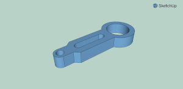          | [`gauge_handle.stl`](model/stl/gauge_handle.stl)                                                | Matte Black  |
| 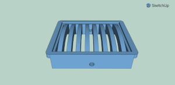              | [`gauge_vent.stl`](model/stl/gauge_vent.stl)                                                    | Matte Black  |
| 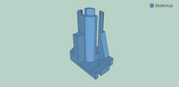            | [`gauge_tower.stl`](model/stl/gauge_tower.stl)                                                  | Matte Black  |
| 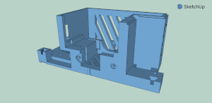              | [`gauge_case.stl`](model/stl/gauge_case.stl)                                                    | Matte Black  |
| 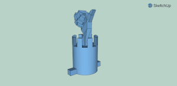            | [`gauge_popup.stl`](model/stl/gauge_popup.stl)                                                  | Brass        |
| 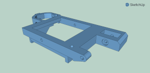                | [`gauge_cap.stl`](model/stl/gauge_cap.stl)                                                      | Brass        |
| 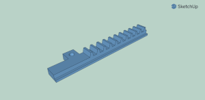          | [`gauge_slider.stl`](model/stl/gauge_slider.stl)                                                | Matte Black  |
|   | [`gauge_gear_small.stl`](model/stl/gauge_gear_small.stl)                                        | Matte Black  |
| 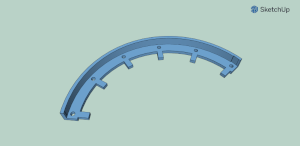| [`gauge_scale_ticks.stl`](model/stl/gauge_scale_ticks.stl)                                      | Brass        |
|                 | [`gauge_tag.stl`](model/stl/gauge_tag.stl)                                                      | Brass        |
| 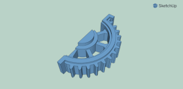  | [`gauge_gear_large.stl`](model/stl/gauge_gear_large.stl)                                        | Brass        |
| 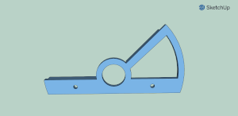| [`gauge_scale_front.stl`](model/stl/gauge_scale_front.stl)                                      | Brass        |
| 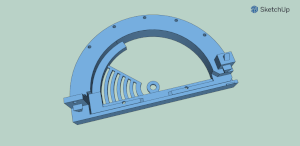  | [`gauge_scale_body.stl`](model/stl/gauge_scale_body.stl)                                        | Matte Black  |
|         | [`gauge_pointer.stl`](model/stl/gauge_pointer.stl)                                              | Brass        |
|     | [`gauge_tower_top.stl`](model/stl/gauge_tower_top.stl)                                          | Matte Black  |

### Additional Printing Information

1. **Print Settings**: Ensure you're using the right settings for PLA on your 3D printer, such as the correct temperature for both the nozzle and bed. The typical settings include a nozzle temperature of 200-210°C and a bed temperature of 50-60°C.

2. **Quality and Layer Height**: For the best appearance and mechanical performance, a layer height of 0.2mm is generally recommended. However, for finer details, you may opt for a smaller layer height around 0.1mm.

3. **Infill**: An infill density around 20% is usually sufficient for these parts.

4. **Assembly Guidelines**: Once all parts are printed, carefully remove them from the print bed. Use sandpaper or a file to smooth out any rough edges or imperfections, especially on moving parts such as the gears and the slider.

5. **Fit and Finish**: Make sure all parts fit together snugly before final assembly. You may need to test-fit parts and make minor adjustments to ensure a perfect assembly. This is particularly important for moving parts and mechanical connections.
## Building and Uploading to Arduino Nano

Follow these detailed instructions to build and upload the Brass Thumb Pomodoro project to your Arduino Nano.

### Step 1: Locate the Arduino Sketch Folder

The Arduino IDE stores sketches (projects) in a predefined location known as the "Sketchbook" folder. To find out where this folder is located on your system:

1. Open the Arduino IDE.
2. Go to `File` -> `Preferences`.
3. In the `Preferences` window, locate the `Sketchbook location:` field. This shows the directory where your sketches are stored.

### Step 2: Create the Project Directory

1. Navigate to the Sketchbook location using your file explorer or terminal.
2. Inside the Sketchbook folder, create a new subfolder named `brass-thumb-pomodoro`.

### Step 3: Move Source Files

1. Copy all contents from the `/src` folder of the Brass Thumb Pomodoro project (e.g., `brass-thumb-pomodoro.ino`, `config.h`, `lib/Clock.h`, `lib/Clock.cpp`, and any other necessary files).
2. Paste these files into the `brass-thumb-pomodoro` folder you just created in your Sketchbook directory.

Your folder structure should look like this:
```
Arduino/Sketchbook/
    └── brass-thumb-pomodoro/
        ├── brass-thumb-pomodoro.ino
        ├── config.h
        └── lib/
            ├── Clock.h
            ├── Clock.cpp
            └── ... (other library files)
```

### Step 4: Open the Project in Arduino IDE

1. In the Arduino IDE, go to `File` -> `Sketchbook`.
2. You should see a list of folders within your Sketchbook directory. Click on `brass-thumb-pomodoro`.

This will open the `brass-thumb-pomodoro.ino` file in the Arduino IDE.

### Step 5: Select Arduino Nano

1. Connect your Arduino Nano to your computer via USB.
2. In the Arduino IDE, go to `Tools` -> `Board` and select `Arduino Nano`.
3. Still under `Tools`, select the appropriate processor. Usually, this is `ATmega328P (Old Bootloader)` or `ATmega328P`, depending on your specific Nano version.
4. Under `Tools` -> `Port`, select the port to which the Arduino Nano is connected (e.g., `COM3` on Windows or `/dev/ttyUSB0` on Linux).

### Step 6: Build and Upload

1. To ensure that all components are compiled correctly, click the checkmark (✓) button in the upper-left corner of the Arduino IDE. This runs a verify/compile check.
   - If there are any errors, review the messages in the console for guidance on fixing them.
2. Once the code compiles without errors, click the right-arrow (→) button (Upload) to upload the code to the Arduino Nano.

### Troubleshooting

- **Compilation Errors**: Ensure that all necessary files are within the `brass-thumb-pomodoro` folder. Missing files can cause compilation issues.
- **Port Issues**: Verify that the correct port is selected under `Tools` -> `Port`. You may need to disconnect and reconnect the USB cable or restart the Arduino IDE to resolve port detection issues.
- **Board Not Detected**: Make sure drivers for the Arduino Nano are correctly installed. Some unofficial Nanos require the installation of additional CH340 drivers.

Congratulations! You have successfully built and uploaded the Brass Thumb Pomodoro project to your Arduino Nano. Enjoy increased productivity with your new steampunk-inspired Pomodoro timer!