## 3D Printing

The Brass Thumb Pomodoro features 3D-printed components to embody its steampunk aesthetic. To achieve the optimal look, print the parts using PLA filament in two colors: matte black and brass. All model files are located in the `./model/stl` directory, and none of the prints require any support structures. Below are the specific files you need to print, along with their respective colors.

### List of Files to Print

| Preview                                              | STL File                                                                                        | Color        |
|------------------------------------------------------|-------------------------------------------------------------------------------------------------|--------------|
| 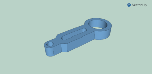          | [`gauge_handle.stl`](../model/stl/gauge_handle.stl)                                                | Matte Black  |
| 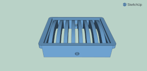              | [`gauge_vent.stl`](../model/stl/gauge_vent.stl)                                                    | Matte Black  |
| 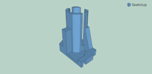            | [`gauge_tower.stl`](../model/stl/gauge_tower.stl)                                                  | Matte Black  |
| 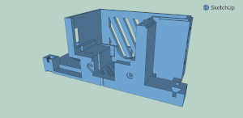              | [`gauge_case.stl`](../model/stl/gauge_case.stl)                                                    | Matte Black  |
| 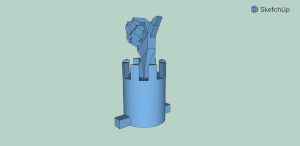            | [`gauge_popup.stl`](../model/stl/gauge_popup.stl)                                                  | Brass        |
| 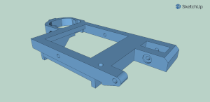                | [`gauge_cap.stl`](../model/stl/gauge_cap.stl)                                                      | Brass        |
| 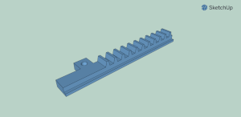          | [`gauge_slider.stl`](../model/stl/gauge_slider.stl)                                                | Matte Black  |
| 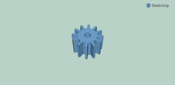  | [`gauge_gear_small.stl`](../model/stl/gauge_gear_small.stl)                                        | Matte Black  |
| 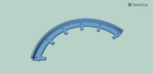| [`gauge_scale_ticks.stl`](../model/stl/gauge_scale_ticks.stl)                                      | Brass        |
| 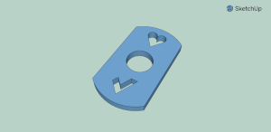                | [`gauge_tag.stl`](../model/stl/gauge_tag.stl)                                                      | Brass        |
| 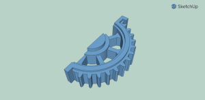  | [`gauge_gear_large.stl`](../model/stl/gauge_gear_large.stl)                                        | Brass        |
| 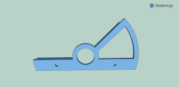| [`gauge_scale_front.stl`](../model/stl/gauge_scale_front.stl)                                      | Brass        |
| 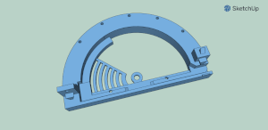  | [`gauge_scale_body.stl`](../model/stl/gauge_scale_body.stl)                                        | Matte Black  |
| 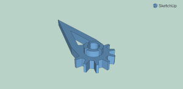        | [`gauge_pointer.stl`](../model/stl/gauge_pointer.stl)                                              | Brass        |
| 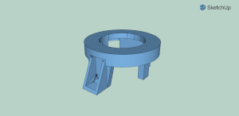    | [`gauge_tower_top.stl`](../model/stl/gauge_tower_top.stl)                                          | Matte Black  |

### Additional Printing Information

1. **Print Settings**: Ensure you're using the right settings for PLA on your 3D printer, such as the correct temperature for both the nozzle and bed. The typical settings include a nozzle temperature of 200-210°C and a bed temperature of 50-60°C.

2. **Quality and Layer Height**: For the best appearance and mechanical performance, a layer height of 0.2mm is generally recommended. However, for finer details, you may opt for a smaller layer height around 0.1mm.

3. **Infill**: An infill density around 20% is usually sufficient for these parts.

4. **Assembly Guidelines**: Once all parts are printed, carefully remove them from the print bed. Use sandpaper or a file to smooth out any rough edges or imperfections, especially on moving parts such as the gears and the slider.

5. **Fit and Finish**: Make sure all parts fit together snugly before final assembly. You may need to test-fit parts and make minor adjustments to ensure a perfect assembly. This is particularly important for moving parts and mechanical connections.
