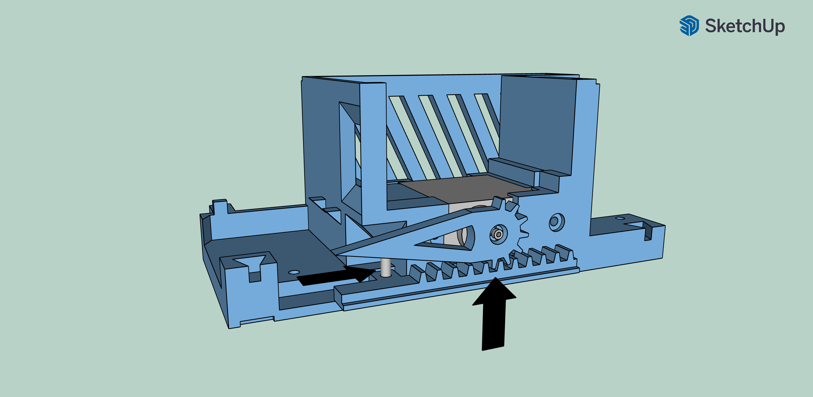
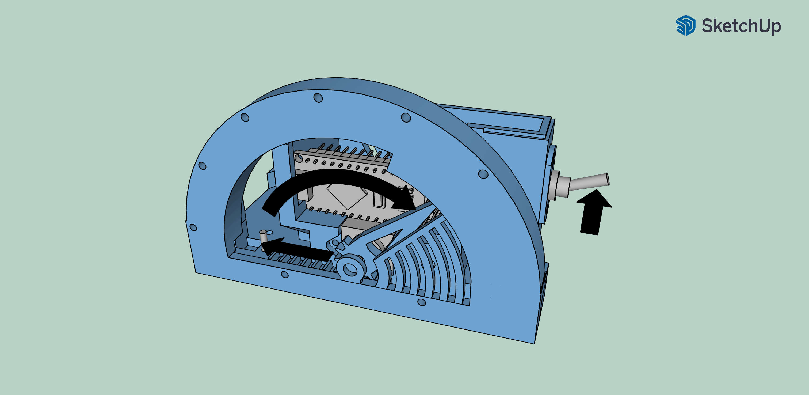
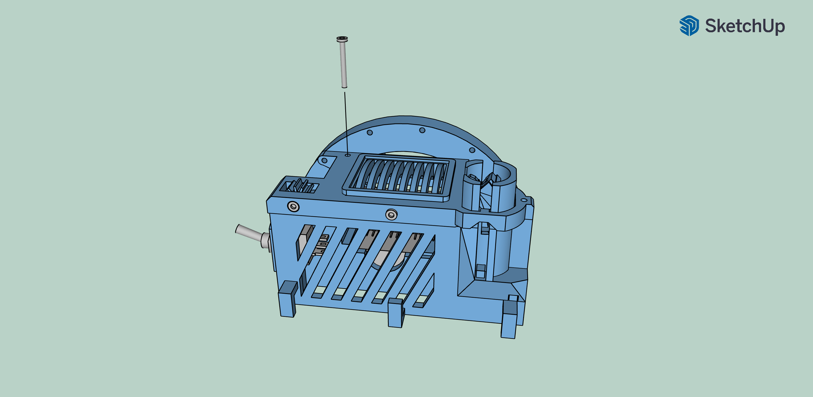
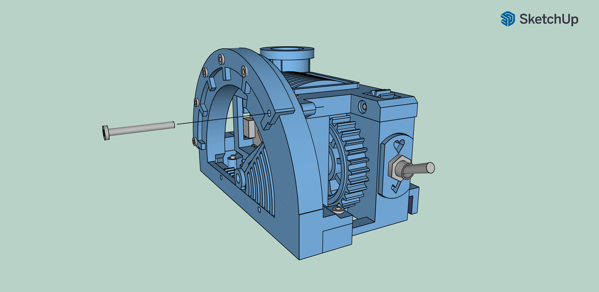

# Brass Thumb Pomodoro Assembly Guide

Welcome to the assembly guide for the Brass Thumb Pomodoro, your steampunk productivity timer. This guide is divided into two parts: 

1. **Preparation**: Assemble smaller components.
2. **Main Assembly**: Combine parts into the final device.

**Prerequisites**: Complete each step sequentially for a smooth assembly.

**Tools needed**: Mini screwdriver, USB power source.

Let's get started!

## Preparation

Before we dive into the main assembly of the Brass Thumb Pomodoro, we'll start by preparing a few smaller components. This step is essential as it will make the final assembly smoother and more efficient. Let's prepare each part carefully.

### Device Top Cover

**Mount Gauge Vent**: Place the `gauge_vent.stl` into the `gauge_cap.stl` as shown. Secure it with two M2x8 screws. 

**Mount Gauge Gear**: Insert the `gauge_gear_small.stl` into the designated slot in `gauge_cap.stl`. Use one M2x16 screw to secure it in place.

### Thumb Up Popup

Prepare the popup mechanism for the Brass Thumb Pomodoro by following these steps:

Insert the 10mm diameter, 5mm height cylinder magnet into the bay of the `gauge_popup.stl` as shown in the image. The magnet's orientation is not important at this stage.

Ensure the magnet fits snugly in the bay. If it’s loose, secure it using adhesive tape on the sides.

### Magnetic Handle
Use the cylinder magnet (D=10mm, h=5mm) as shown below. The orientation of the magnet does not matter at this stage. Place the magnet securely in the bay of `gauge_handle.stl`. If it is loose, use adhesive tape on the sides to tighten it.

### Rack Gear

Insert the M2x8 screw through the hole from the bottom side of the rack gear (`gauge_slider.stl`) and tighten it until firmly held in place. This will be used later to mount other elements.

## Main Assembly of the Device

With all the smaller components prepared, it's time to bring everything together to complete your Brass Thumb Pomodoro. The following steps will guide you through assembling the main parts of the device, connecting the Arduino board and servo, and securing everything into the final, functional timer. Follow each step carefully to ensure all components fit together seamlessly, and your device operates smoothly.

### Install Scale

Align the `gauge_scale_body.stl` with the dovetail joints on the `gauge_case.stl` housing. Carefully slide the `gauge_scale_body.stl` into the joints, ensuring it is placed securely and flush with the main housing. 

### Add Rack Gear

Insert the previously assembled rack gear (`gauge_slider.stl`) into the guide slot in the main body. Ensure the gear teeth face towards the inner mechanism and the rack gear can move freely sideways.

### Mount Pointer

Use the screw delivered with the servo to attach the pointer (`gauge_pointer.stl`) to the servo. Insert the screw through the center hole of the pointer and secure it into the servo as shown below.

Proper pointer positioning is crucial. Follow these steps to ensure accuracy:

1. Set the mode switch to the neutral (central) position.
2. Power up the Arduino. This will cause the servo to move back and forth, eventually stopping at the most left position.

In this position, the pointer should be oriented to point left. Ensure the pointer can move smoothly through 90 degrees (pointing up) and up to 180 degrees (pointing right).

Make sure the servo is oriented correctly with the longer part on the right as illustrated below.

### Mount Servo

Slide the servo into the housing (`gauge_case.stl`) into the dedicated bay as shown in the image.

Make sure the gear on the pointer (`gauge_pointer.stl`) is properly positioned to the rack gear (`gauge_slider.stl`). The gear teeth should fit together perfectly. Ensure that the pointer of the servo is pointing to the left, while the pin mount of the rack gear should be placed to the most right in its slot as displayed in the image below.

### Mount Arduino Board

Slide the Arduino board into the housing (`gauge_case.stl`) in the dedicated slot, above the servo.

Make sure the Arduino board is securely and properly installed, with the USB port facing outward for easy access.

### Mount Switch

Place the three-position mode switch into the mounting hole of `gauge_case.stl`.

Position the mode tag (`gauge_tag.stl`) on the switch with the correct orientation (ensure the heart symbol is at the top). Secure the tag with the screw nut provided.

Ensure the switch and tag are firmly in place, as shown below.

### Install Magnetic Handler

Turn the mode switch to the up position (break mode). This moves the pointer to the right and the rack gear to the left, making the pin on the rack gear more accessible.

**IMPORTANT**: The 3-position switch is symmetric and can be installed upside down. If this happens, reorient the switch, or switch it to the down position. You can swap its positions in the code later if necessary.

Place the `gauge_handle.stl` mounting hole onto the pin of the rack gear.

Ensure that the magnets installed in both `gauge_handle.stl` and `gauge_popup.stl` are oriented to push away from each other. If not, reorient the `gauge_handle.stl`.

Orient the `gauge_handle.stl` so its guide slot aligns with the hole in the housing (`gauge_case.stl`).

### Install Thumb Up Popup

Slide the `gauge_tower.stl` into the dedicated slots of the `gauge_case.stl`.

Secure the `gauge_tower.stl` with an M2x16 screw, ensuring the screw passes through the guide slot of the `gauge_handle.stl`.

Slide the `gauge_popup.stl` into the `gauge_tower.stl`.

Ensure the `gauge_popup.stl` is hidden inside the `gauge_tower.stl` and can move freely up and down.

### Install Top Cover

Slide the `gauge_gear_large.stl` into the slot of the `gauge_case.stl`. This step will not secure the gear yet; we’ll take care of that in the next steps.

Place the previously assembled top cover onto the housing (`gauge_case.stl`), ensuring it secures the `gauge_gear_large.stl` and aligns with `gauge_tower.stl`.

Secure the top cover with an M2x16 screw to hold everything firmly in place.

Slide the `gauge_tower_top.stl` into the `gauge_tower.stl`, ensuring a snug fit. Secure it with an M2x16 screw.

Secure the scale with an M2x8 screw.

### Install Scale Decors

Mount the `gauge_scale_ticks.stl` onto the casing (`gauge_case.stl`) by securing it with five M2x8 screws. Note that the last, most right screw hole should be left empty for now.

Once the `gauge_scale_ticks.stl` is in place, use an M2x16 screw to securely mount the scale into the housing (`gauge_case.stl`).

Finally, mount the `gauge_scale_front.stl` onto the device using two M2x8 screws.

This completes the installation of the scale decors for your Brass Thumb Pomodoro. Ensure all screws are securely fastened for stable and accurate operation of the device.