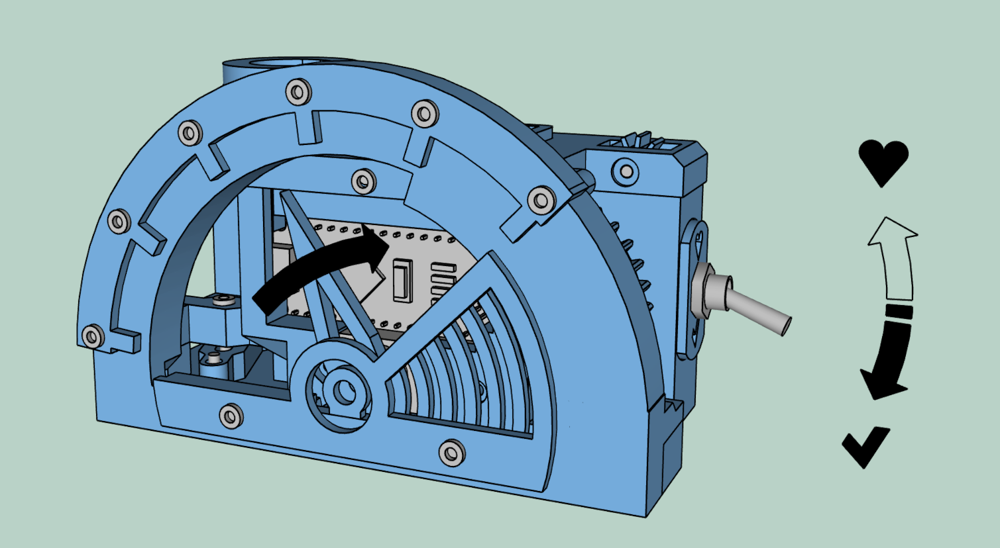
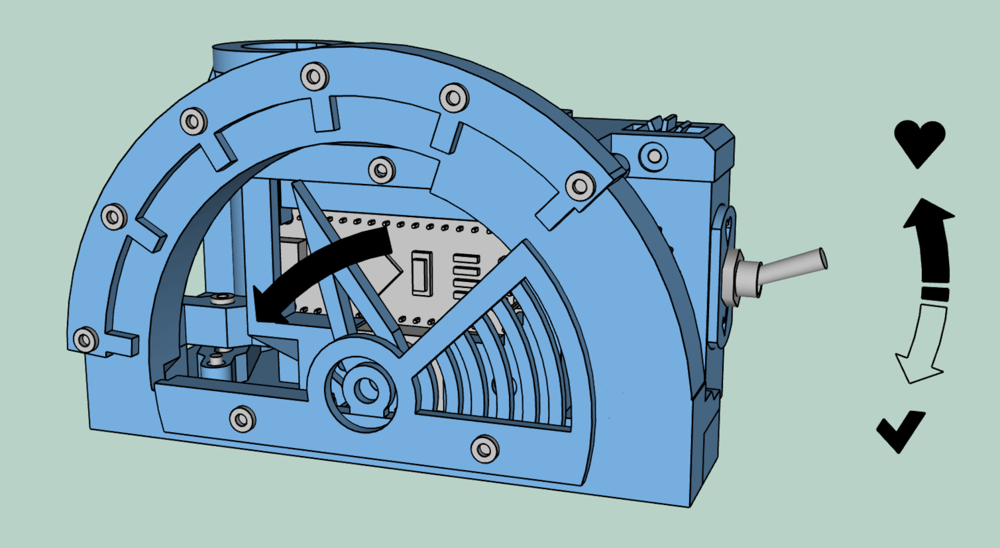
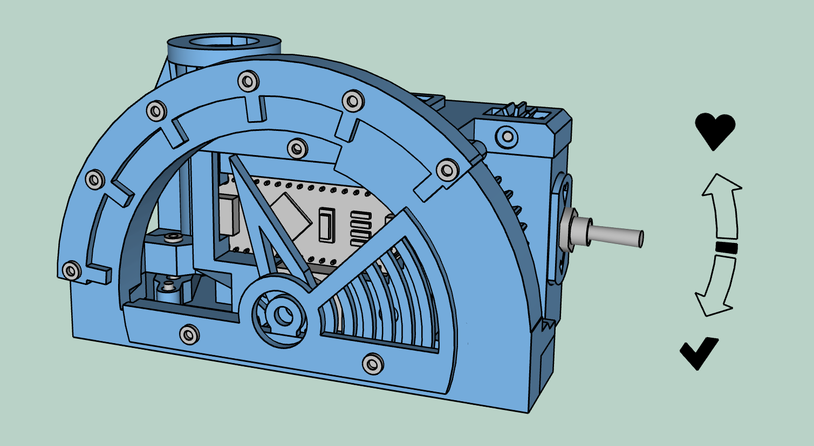

# User Manual

## Getting Started

1. **Power the Device**: Connect using a USB cable.
2. **Set the Timer**:
   - **Down Position (Work Mode)**: 25-minute work interval.
   - **Up Position (Rest Mode)**: 5-minute break interval.
   - **Middle Position (Pause Mode)**: Pause the timer.

## Operating Instructions

### Initial Testing Sequence
1. **Power On**:
   - After powering on, the device's pointer will move back and forth to test if the thumbs-up mechanism works properly.
   - Ensure the thumbs-up figure pops out and retracts smoothly during this test.

### Work Mode

1. Slide the switch up for a 25-minute work period.
2. The timer counts down from 25 minutes.
3. The thumbs-up figure pops up when the work period is complete.

### Rest Mode

1. Slide the switch down for a 5-minute rest period.
2. The timer counts down from 5 minutes, during which the pointer will move backward to indicate rest. 
3. Switch back to work mode as needed.

### Pause Mode

1. Slide the switch to the middle to pause the timer in either work or rest mode.
2. Slide the switch back to resume the timer from where it paused.

## Maintenance

- **Cleaning**:
  - Use a soft, damp cloth to clean the exterior.
  - Avoid using water or any liquid directly on electronic parts.
  - Do not use harsh chemicals or abrasives.

- **Storage**:
  - Store the timer in a dry place when not in use.
  - Avoid exposing the device to extreme temperatures or humidity.
  - Keep the device away from dust and direct sunlight.

## Troubleshooting

- **Not Powering On**:
  - Ensure the USB connection is secure.
  - Try a different USB power source or cable.
  - Check for any visible damage to the USB port.

- **Timer Not Starting/Malfunctioning**:
  - Verify the switch position; ensure it's fully engaged in the desired mode.
  - Reset the device by unplugging and replugging it.

- **Thumbs-Up Figure Issues**:
  - Ensure the device is on a stable and level surface.
  - Manually check if the thumbs-up figure is obstructed or stuck.
  - If persistent, disconnect and reconnect the USB power to reset the system.

Enjoy your productivity with The Brass Thumb Pomodoro!