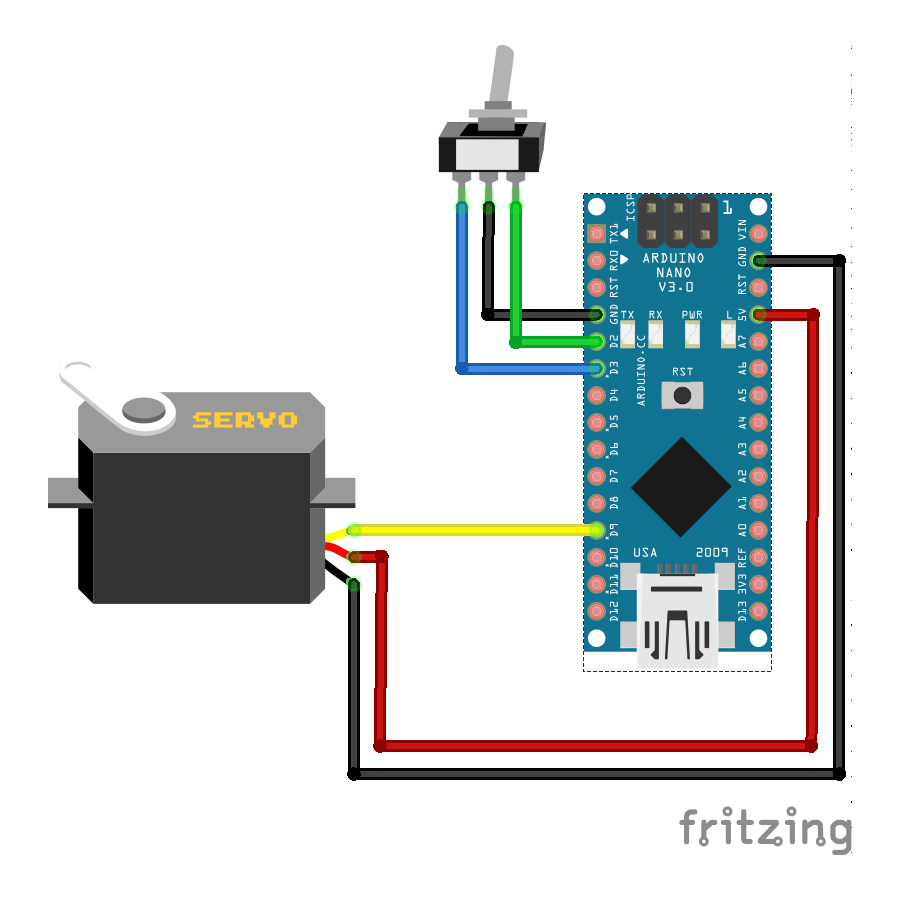

## Wiring Electronics

To assemble the wiring for the **Brass Thumb Pomodoro**, follow the diagram provided below. 

Here's a detailed step-by-step guide:

1. **Servo Motor Connections**:
   - Connect the signal pin of the servo motor (usually the yellow or white wire) to pin `D9` on the Arduino Nano.
   - Use female jumper wires to connect the `VCC` (red wire) and `GND` (black wire) of the servo motor to the respective `5V` and `GND` pins on the Arduino Nano. 
   - If the servo motor's pins are merged together in a single socket, you may need to modify the connections to fit the Arduino pins that are not adjacent to each other.

2. **Switch Connections**:
   - Solder female jumper wire to the one side of the switch and connect it to pin `D2` on the Arduino Nano.
   - Solder female jumper wire to the middle pin of the switch and connect it to the `GND` pin on the Arduino Nano.
   - Solder female jumper wire to the other side of the switch and connect it to pin `D3` on the Arduino Nano.

### Additional Wiring Information

1. **Connector Types and Usage**: For this project, using female jumper wires is recommended for connecting components to the Arduino Nano.

2. **Soldering Tips**: When soldering wires to the switch, ensure that your soldering iron is at the right temperature (around 350°C). Tin the wire and the switch terminal before joining them together. Apply heat to the joint and feed solder into the connection. Always work in a well-ventilated area and wear safety goggles.

3. **Power Supply Considerations**: The Arduino Nano and servo motor can be powered via the USB connection. Ensure your USB power source provides at least `500mA` of current. If using an external power source, verify that it meets the voltage and current requirements of your components.

4. **Cable Management**: Choosing the proper length of cables is crucial for both fitting the components inside the case and ensuring ease of assembly. Cables should be long enough to allow for easy connection and movement of components during assembly, but not so long that they create unnecessary bulk or clutter inside the case.

5. **Testing Connections**: Before powering on the device, test the continuity of your connections with a multimeter. Check for any shorts or open circuits. If the device does not function correctly, verify all connections against the wiring diagram and ensure that the Arduino Nano is properly programmed and connected.

